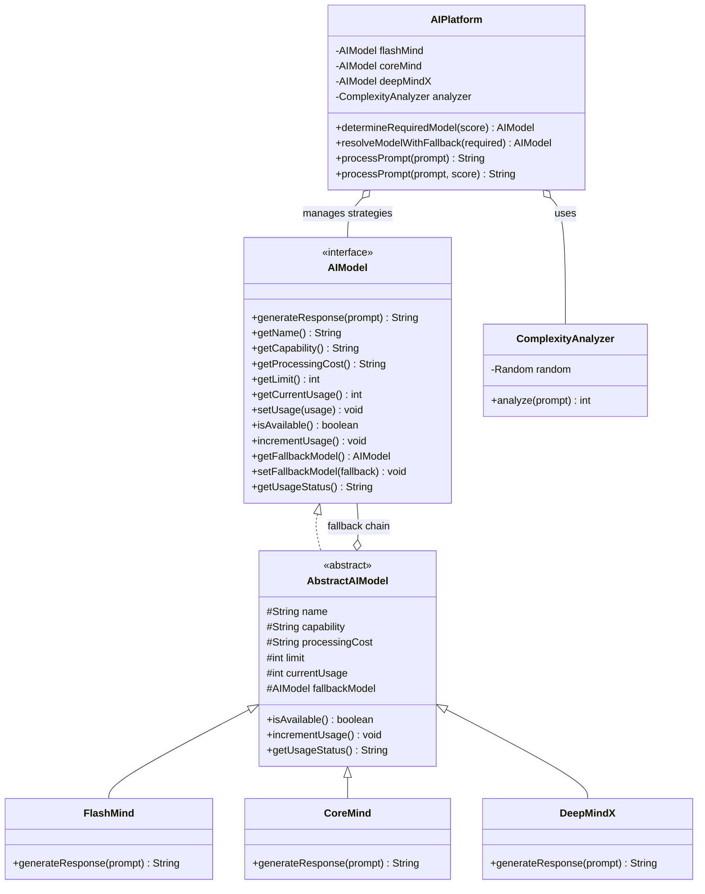
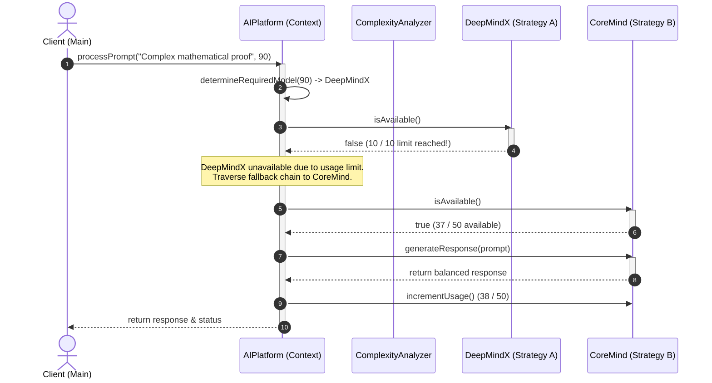

# Problem Statement: Automatic AI Model Selection System

**Batch**: CSE23
**Source**: `Automatic AI Model Selection System.pdf`
**Duration**: 25 Minutes
**Design Pattern**: **Strategy Pattern** (with **Chain of Responsibility** Fallback Delegation)

---

## 1. Problem Description

An AI platform provides access to three distinct language models with varying capabilities, processing costs, and prompt limits:

| Model | Capability | Processing Cost | Prompt Limit | Ideal Use Case |
|:---|:---:|:---:|:---:|:---|
| **FlashMind** | Basic | Low | **Unlimited** | Simple requests, fast responses |
| **CoreMind** | Medium | Medium | **50 prompts** | Moderately complex requests |
| **DeepMindX** | High | High | **10 prompts** | Difficult requests requiring advanced multi-step reasoning |

All three models share the uniform operation:
```java
String generateResponse(String prompt);
```
However, each model processes the prompt differently according to its algorithmic depth.

---

### Prompt Complexity Analysis & Selection Rules
Before selecting a model, the system analyzes the complexity of the submitted prompt using `ComplexityAnalyzer`. The analyzer returns a complexity score between `0` and `100`:

| Complexity Score | Required Model |
|:---:|:---|
| **0 – 30** | `FlashMind` |
| **31 – 70** | `CoreMind` |
| **71 – 100** | `DeepMindX` |

### Model Usage Limits & Fallback Order
- The platform restricts the number of prompts processed by the more expensive models (`DeepMindX` max 10, `CoreMind` max 50).
- **Fallback Rule**: If the selected model has reached its usage limit, the system must try the next lower model.
- **Fallback Order**:
  $$\text{DeepMindX} \longrightarrow \text{CoreMind} \longrightarrow \text{FlashMind}$$
- **Constraint**: *"A more powerful model should not be selected unnecessarily."* Simple requests ($0 \le \text{Score} \le 30$) always route directly to `FlashMind` without up-selection.

---

## 2. Design Pattern & Strategy for Solving

### Why Strategy Pattern?
- **Interchangeable Algorithms**: Each AI model (`FlashMind`, `CoreMind`, `DeepMindX`) encapsulates a distinct response generation strategy behind a unified `AIModel` interface (`generateResponse(String prompt)`).
- **Decoupled Client**: The `AIPlatform` context executes model generation polymorphically without needing to know model-specific parsing or inference internals.
- **Open/Closed Principle**: New models (e.g., `VisionMind`, `AudioMind`) can be added without modifying the core platform dispatch logic.

### Why Chain of Responsibility for Fallback?
- Models maintain a reference to their next fallback tier (`fallbackModel`).
- When a model's quota is exhausted (`!model.isAvailable()`), the request flows down the chain:
  `DeepMindX` &rarr; `CoreMind` &rarr; `FlashMind`.
- Because `FlashMind` has unlimited quota, the fallback chain is guaranteed to terminate successfully.

---

## 3. Class Diagram



---

## 4. Sequence Flow: Routing & Fallback



---

## 5. Specification Scenario Walkthroughs

### Example Scenario 1 (Normal High-Complexity Routing)
- **Prompt**: *"Synthesize a unified mathematical proof for Riemannian topology."*
- **Complexity Score**: `84`
- **Initial State**: `DeepMindX Usage = 7 / 10`, `CoreMind Usage = 24 / 50`
- **Result**:
  - `Required Model = DeepMindX`
  - `Selected Model = DeepMindX`
  - `After processing: DeepMindX Usage = 8 / 10`

### Example Scenario 2 (Usage Limit Exceeded & Single Fallback)
- **Prompt**: *"Design a distributed multi-datacenter consensus algorithm."*
- **Complexity Score**: `90`
- **Initial State**: `DeepMindX Usage = 10 / 10` (Limit reached), `CoreMind Usage = 37 / 50`
- **Result**:
  - `Required Model = DeepMindX`
  - `DeepMindX unavailable due to usage limit.`
  - `Selected Model = CoreMind`
  - `After processing: CoreMind Usage = 38 / 50`

### Example Scenario 3 (Simple Prompt Without Up-Selection)
- **Prompt**: *"What is the capital of France?"*
- **Complexity Score**: `22`
- **Result**:
  - `Required Model = FlashMind`
  - `Selected Model = FlashMind`
  - *No higher model selected unnecessarily.*

### Scenario 4 (Double Fallback on Resource Exhaustion)
- **Complexity Score**: `95`
- **Initial State**: `DeepMindX = 10 / 10`, `CoreMind = 50 / 50`
- **Result**:
  - `DeepMindX unavailable due to usage limit.`
  - `CoreMind unavailable due to usage limit.`
  - `Selected Model = FlashMind` (Unlimited fallback guarantee)

---

## 6. How to Build & Run

```bash
# Navigate to the problem folder
cd CSE23/AutomaticAIModelSelectionSystem

# Compile all source files
javac *.java

# Run the test driver
java Main
```
