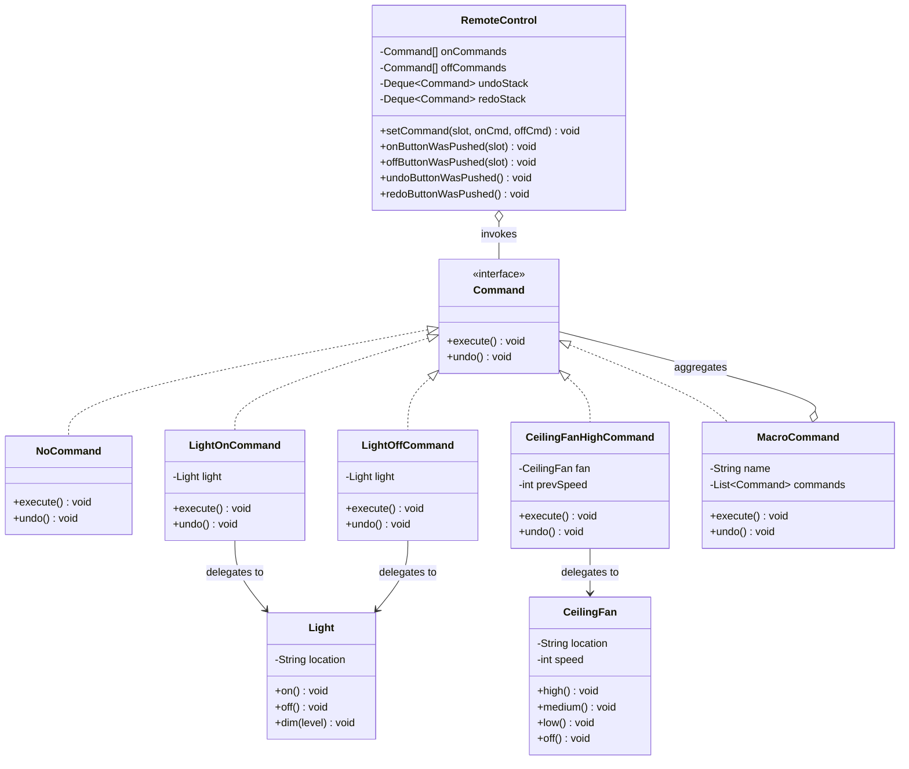
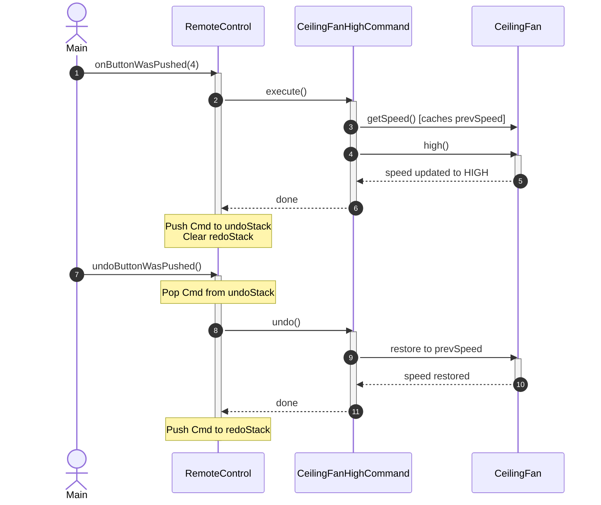

# Command Design Pattern - Comprehensive Template

## 1. Overview & Intent

The **Command Pattern** is a behavioral design pattern that converts a request or operation into a stand-alone object containing all information about the request. This transformation lets you parameterize methods with different requests, delay or queue a request's execution, log request history, and support reversible operations (undo/redo).

### Formal GoF Definition
> *"Encapsulate a request as an object, thereby letting you parameterize clients with different requests, queue or log requests, and support undoable operations."*

---

## 2. Real-World Analogy & Motivation

### Real-World Analogy
Think of a **restaurant order**:
1. You (the **Client**) tell the waiter your meal choices.
2. The waiter writes your order onto an order pad (the **Command**).
3. The order pad encapsulates the request: table number, dish specifics, and cooking preferences.
4. The waiter delivers the order slip to the kitchen counter (**Invoker** queues or schedules).
5. The chef (**Receiver**) reads the order slip and prepares the dishes.
6. The waiter does not need to know how to cook duck confit, and the chef does not need to know which customer placed the order.

### Problem It Solves
- **Tight Coupling**: Direct calls between the user interface (buttons, menus, shortcuts) and business logic create rigid, unmaintainable code.
- **Undo/Redo**: Maintaining a history of user actions to reverse state mutations is tedious without self-contained command objects.
- **Queuing & Scheduling**: Background job schedulers, thread pools, and distributed task queues require operations packaged as portable work units.

---

## 3. Pattern Architecture & Structure



### Core Participants

| Component | Class in Template | Role & Responsibility |
|:---|:---|:---|
| **Command** | [`Command`](Command.java) | Declares standard execution interface (`execute()`, `undo()`). |
| **Concrete Command** | [`LightOnCommand`](LightOnCommand.java), [`CeilingFanHighCommand`](CeilingFanHighCommand.java) | Binds a Receiver to an action. Implements `execute()` by calling methods on the receiver, and tracks prior state for `undo()`. |
| **Receiver** | [`Light`](Light.java), [`Stereo`](Stereo.java), [`CeilingFan`](CeilingFan.java) | Performs actual domain operations. Contains the business logic. |
| **Invoker** | [`RemoteControl`](RemoteControl.java) | Holds command slots, invokes `execute()` when triggered, and manages undo/redo history stacks. |
| **Client** | [`Main`](Main.java) | Creates receivers, instantiates commands, configures invoker slots, and triggers actions. |
| **Composite Command** | [`MacroCommand`](MacroCommand.java) | Executes a sequence of commands sequentially and reverses them in exact reverse order. |
| **Null Object** | [`NoCommand`](NoCommand.java) | Eliminates null checks when slots are empty or unassigned. |

---

## 4. Execution & Sequence Flow



---

## 5. Key Implementation Features in this Template

### 1. Multi-Level Undo and Redo Stacks
Using Java's `Deque<Command>` (`ArrayDeque`):
```java
public void onButtonWasPushed(int slot) {
    Command command = onCommands[slot];
    command.execute();
    undoStack.push(command);
    redoStack.clear(); // Any new action invalidates forward redo history
}

public void undoButtonWasPushed() {
    if (!undoStack.isEmpty()) {
        Command cmd = undoStack.pop();
        cmd.undo();
        redoStack.push(cmd);
    }
}
```

### 2. State-Tracking Undo (Ceiling Fan)
Commands that control multi-valued receivers store the receiver's state *before* mutating it:
```java
@Override
public void execute() {
    prevSpeed = fan.getSpeed();
    fan.high();
}

@Override
public void undo() {
    restorePreviousSpeed(prevSpeed);
}
```

### 3. Null Object Pattern (`NoCommand`)
Avoids repetitive `if (onCommands[slot] != null)` boilerplate across all invoker methods:
```java
for (int i = 0; i < slots; i++) {
    onCommands[i] = new NoCommand();
    offCommands[i] = new NoCommand();
}
```

### 4. Macro / Composite Commands
Allows one button press to trigger an arbitrary sequence of heterogeneous commands (e.g., "Party Mode"):
```java
MacroCommand partyOn = new MacroCommand("Party Mode", lightOn, stereoOn, fanHigh);
partyOn.execute(); // Executes all in order
partyOn.undo();    // Undoes all in reverse order
```

---

## 6. Comparison with Related Patterns

| Criteria | Command Pattern | Strategy Pattern | Memento Pattern | State Pattern |
|:---|:---|:---|:---|:---|
| **Primary Intent** | Encapsulate an action/request as an object | Encapsulate interchangeable algorithms/behaviors | Capture and externalize an object's internal state | Change object behavior when internal state changes |
| **Who initiates?** | Invoker triggered by UI or scheduler | Context executing business calculation | Originator creating a snapshot | Context delegating according to active state |
| **Undo Support** | Native (via `undo()` method) | Not applicable | Native (restoring snapshot) | Not inherently supported |
| **Coupling** | Invoker decoupled from Receiver | Context decoupled from concrete algorithm | Originator decoupled from caretaker | Context decoupled from concrete state classes |

---

## 7. Pros & Cons

### Pros
- **Decoupling**: The object invoking an operation is completely insulated from the object performing the operation.
- **Open/Closed Principle**: New commands can be added without modifying existing invokers or receivers.
- **Composite Commands**: Readily supports chaining commands into complex macros.
- **Queueing & Scheduling**: Commands can be serialized, queued, logged, or dispatched across network boundaries.

### Cons
- **Class Proliferation**: Each distinct action requires a new concrete command class (mitigated in modern Java using Lambdas or method references where undo is unnecessary).

---

## 8. How to Compile & Run

```bash
# Navigate to the template directory
cd patterns/Command

# Compile all source files
javac *.java

# Execute the demonstration
java Main
```
