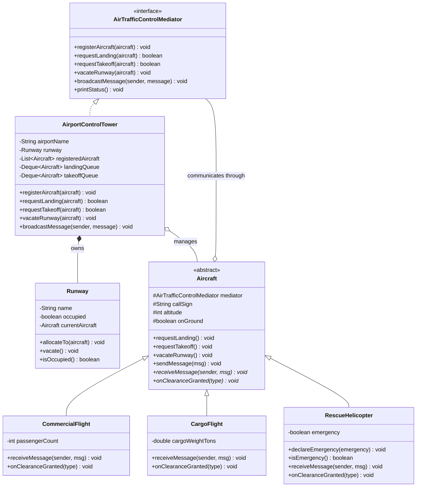
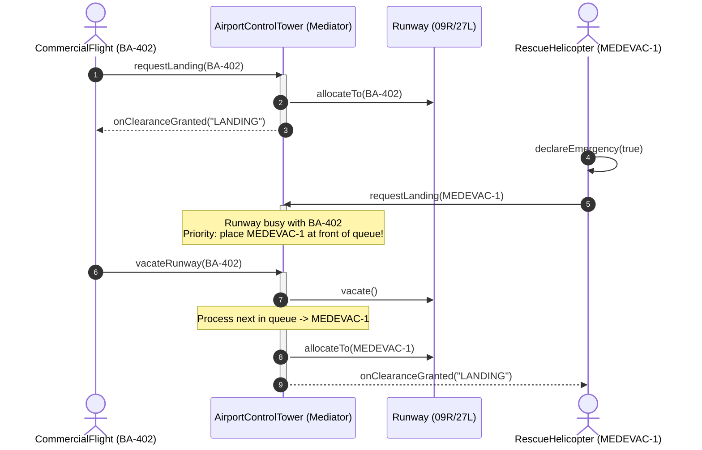

# Mediator Design Pattern - Comprehensive Template

## 1. Overview & Intent

The **Mediator Pattern** is a behavioral design pattern that reduces chaotic dependencies between objects by restricting direct communication between them and forcing them to collaborate solely through a centralized mediator object.

### Formal GoF Definition
> *"Define an object that encapsulates how a set of objects interact. Mediator promotes loose coupling by keeping objects from referring to each other explicitly, and it lets you vary their interaction independently."*

---

## 2. Real-World Analogy & Motivation

### Real-World Analogy
Consider an **Air Traffic Control (ATC) Tower**:
- Pilots of incoming aircraft do not communicate directly with one another to decide who lands first on Runway 09R.
- Doing so would create an $O(N^2)$ communication mesh of confusion, language barriers, and hazardous collisions.
- Instead, every pilot speaks exclusively to the **Control Tower** (the **Mediator**).
- The tower monitors airspace, prioritizes incoming flights, manages the runway queue, accommodates emergency medevac flights, and grants clearances.

### Problem It Solves
- **Tangled Interdependencies ("Spaghetti Code")**: In complex multi-component systems (e.g., UI dialogs, distributed coordinators), components directly referencing each other lead to rigid monoliths where changing one component breaks five others.
- **Low Reusability**: Components tightly bound to specific peer implementations cannot easily be reused in isolation.

---

## 3. Pattern Architecture & Structure



### Core Participants

| Component | Class in Template | Role & Responsibility |
|:---|:---|:---|
| **Mediator Interface** | [`AirTrafficControlMediator`](AirTrafficControlMediator.java) | Declares communication methods between aircraft, queueing, and runway clearances. |
| **Concrete Mediator** | [`AirportControlTower`](AirportControlTower.java) | Encapsulates the collective behavior: coordinates the shared [`Runway`](Runway.java), manages holding queues, and resolves emergency escalations. |
| **Colleague (Abstract)** | [`Aircraft`](Aircraft.java) | Maintains a reference to the mediator; initiates operations exclusively through mediator requests. |
| **Concrete Colleagues** | [`CommercialFlight`](CommercialFlight.java), [`CargoFlight`](CargoFlight.java), [`RescueHelicopter`](RescueHelicopter.java) | Implement specific reactions to clearances and incoming broadcast alerts. |
| **Managed Resource** | [`Runway`](Runway.java) | Shared domain asset allocated and protected by the mediator. |
| **Client** | [`Main`](Main.java) | Initializes the mediator and colleagues, triggering workflow actions. |

---

## 4. Execution & Sequence Flow



---

## 5. Key Implementation Highlights

### 1. Zero Direct Colleague-to-Colleague References
Colleagues never import or reference other concrete colleague classes. To send a safety advisory:
```java
// Aircraft.java
public void sendMessage(String message) {
    mediator.broadcastMessage(this, message);
}
```
The mediator distributes the message to all other registered colleagues without any colleague knowing the peer topology.

### 2. Centralized Priority Scheduling & Queuing
The mediator encapsulates complex business rules (e.g. landings take priority over takeoffs, and emergency aircraft bypass normal FIFO order):
```java
if (aircraft.isEmergency()) {
    landingQueue.addFirst(aircraft); // Jump to the front
} else {
    landingQueue.addLast(aircraft);
}
```

### 3. Automatic Resource Handoff Cascading
When an aircraft vacates the runway, the mediator automatically handles the transition and grants the next clearance without client orchestration:
```java
public void vacateRunway(Aircraft aircraft) {
    runway.vacate();
    processNextInQueue(); // Automatically schedules the next flight
}
```

---

## 6. Comparison with Related Patterns

| Aspect | Mediator Pattern | Observer Pattern | Facade Pattern |
|:---|:---|:---|:---|
| **Communication Direction** | Bidirectional (colleagues &harr; mediator) | Unidirectional (Subject &rarr; Observers) | Unidirectional (Client &rarr; Subsystem) |
| **Intent** | Coordinate complex interactions between peer objects | Notify dependents when state changes | Provide a simplified interface to a complex subsystem |
| **Decoupling** | Replaces $N \times N$ connections with $N \times 1$ | Replaces polling with event notifications | Masks internal subsystem complexity |
| **Risk** | Mediator can become an oversized "God Object" | Memory leaks (Lapsed Listener), cascading update loops | Subsystem may still be used directly if not restricted |

---

## 7. Pros & Cons

### Pros
- **Single Responsibility Principle**: Centralizes relations and coordination protocols in one place.
- **Open/Closed Principle**: You can introduce new colleagues without altering the mediator interface or other colleagues.
- **Reduced Subclassing**: Colleague behavior can be customized via mediator logic rather than overriding colleague classes.
- **Clarity**: Eliminates webs of cross-referencing dependencies.

### Cons
- **God Object Risk**: Over time, a mediator can accrue excessive coordination logic, becoming difficult to maintain and test.

---

## 8. How to Compile & Run

```bash
# Navigate to the template directory
cd patterns/Mediator

# Compile all source files
javac *.java

# Run the demonstration
java Main
```
