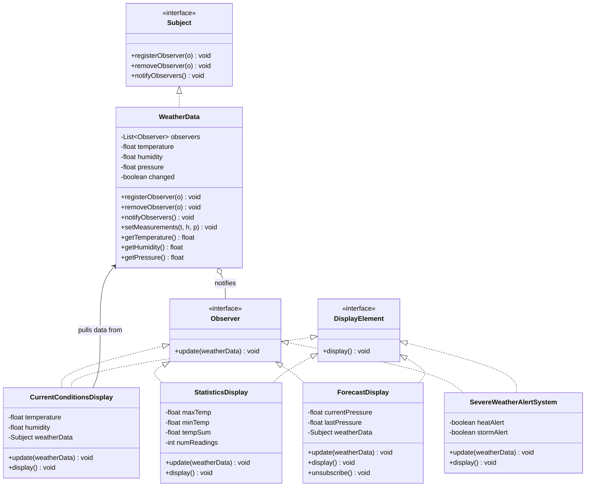
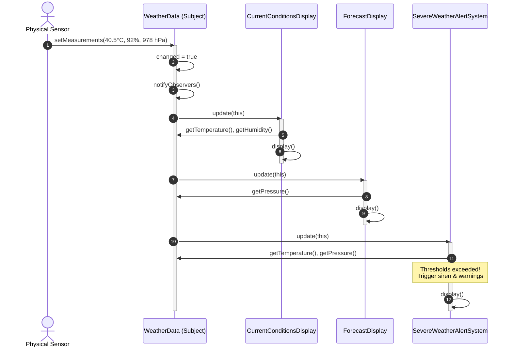

# Observer Design Pattern - Comprehensive Template

## 1. Overview & Intent

The **Observer Pattern** is a behavioral design pattern that defines a one-to-many dependency between objects so that when one object (the **Subject**) changes its state, all its dependents (the **Observers**) are automatically notified and updated.

### Formal GoF Definition
> *"Define a one-to-many dependency between objects so that when one object changes state, all its dependents are notified and updated automatically."*

---

## 2. Real-World Analogy & Motivation

### Real-World Analogy
Think of a **newspaper or magazine subscription**:
- The publisher produces new editions of the newspaper.
- Customers who subscribe receive new issues delivered directly to their doorstep without repeatedly calling the publisher.
- When a customer cancels their subscription, deliveries stop immediately.
- The publisher has no dependency on *how* subscribers read the newspaper (reading over breakfast, recycling, or cutting coupons).

### Problem It Solves
- **Inefficient Polling**: Without observers, client objects must continuously poll the subject in tight loops (`while (hasChanged())`), burning CPU cycles and network bandwidth.
- **Tight Coupling**: Hardcoding notification calls to specific client classes makes adding or removing subscribers impossible without editing the subject's core code.

---

## 3. Pattern Architecture & Structure



### Core Participants

| Component | Class in Template | Role & Responsibility |
|:---|:---|:---|
| **Subject Interface** | [`Subject`](Subject.java) | Contract for registering, unregistering, and broadcasting notifications. |
| **Concrete Subject** | [`WeatherData`](WeatherData.java) | Maintains physical telemetry state, tracks subscribers, and triggers updates when readings change. |
| **Observer Interface** | [`Observer`](Observer.java) | Defines standard callback method (`update(WeatherData data)`). |
| **Display Contract** | [`DisplayElement`](DisplayElement.java) | Standard visual rendering interface (`display()`). |
| **Concrete Observers** | [`CurrentConditionsDisplay`](CurrentConditionsDisplay.java), [`StatisticsDisplay`](StatisticsDisplay.java), [`ForecastDisplay`](ForecastDisplay.java), [`SevereWeatherAlertSystem`](SevereWeatherAlertSystem.java) | React independently to state updates, pulling specific telemetry attributes as needed. |
| **Client** | [`Main`](Main.java) | Instantiates the Subject, attaches Observers, and simulates environmental metric updates. |

---

## 4. Execution & Sequence Flow



---

## 5. Architectural Deep Dive: Push vs. Pull Model

### The Push Model
The Subject sends detailed state data as method arguments:
```java
void update(float temp, float humidity, float pressure);
```
- **Advantage**: Simpler for trivial payloads.
- **Drawback**: Violates Open/Closed Principle. If a new metric (e.g., Wind Speed) is introduced, the `update()` signature breaks across every observer in the codebase.

### The Pull Model (Implemented in this Template)
The Subject sends a reference to itself, letting observers query only what they require:
```java
void update(WeatherData data);
```
- **Advantage**: Observers are decoupled from irrelevant metrics. `CurrentConditionsDisplay` queries temperature, while `ForecastDisplay` queries only barometric pressure. Future metrics can be added to `WeatherData` without breaking any existing observer signatures.

---

## 6. Critical Engineering Considerations

### 1. The Lapsed Listener Problem (Memory Leaks)
In Java, if a short-lived Observer registers with a long-lived Subject without unregistering, the Subject holds a strong reference to the Observer, preventing the Garbage Collector from freeing it.
- **Solution**: Always provide an `unsubscribe()` lifecycle hook, or use `java.lang.ref.WeakReference` inside the Subject's observer list.

### 2. Concurrent Modification During Notification
If an observer calls `removeObserver(this)` inside its own `update()` callback, iterating over `observers` directly throws a `ConcurrentModificationException`.
- **Solution**: Iterate over a defensive copy or snapshot:
```java
List<Observer> snapshot = new ArrayList<>(this.observers);
for (Observer o : snapshot) {
    o.update(this);
}
```

---

## 7. Comparison with Related Patterns

| Feature | Observer Pattern | Publish-Subscribe (Pub-Sub) | Mediator Pattern |
|:---|:---|:---|:---|
| **Topology** | Direct 1-to-Many | Brokered (Message Broker / Channel) | Many-to-Many coordinated via Central Hub |
| **Awareness** | Subject maintains list of Observers | Publishers and Subscribers are completely unaware of each other | Colleagues know only the Mediator |
| **Execution** | Typically synchronous in-process | Typically asynchronous / cross-process | Typically synchronous in-process |
| **Use Case** | Local state updates (UI, sensors) | Distributed events (Kafka, RabbitMQ) | Complex component workflow coordination |

---

## 8. Pros & Cons

### Pros
- **Open/Closed Principle**: You can add new observer classes without modifying the subject.
- **Dynamic Subscriptions**: Observers can join or leave the notification network at runtime.
- **Clean Separation of Concerns**: Core domain logic in Subject is decoupled from presentation and alerting logic.

### Cons
- **Unpredictable Update Order**: Observers are notified in arbitrary order; dependencies between observers cannot be guaranteed.
- **Cascading Updates**: Complex chains of observers triggering subjects can create recursive update storms.

---

## 9. How to Compile & Run

```bash
# Navigate to the template directory
cd patterns/Observer

# Compile all source files
javac *.java

# Run the demonstration
java Main
```
