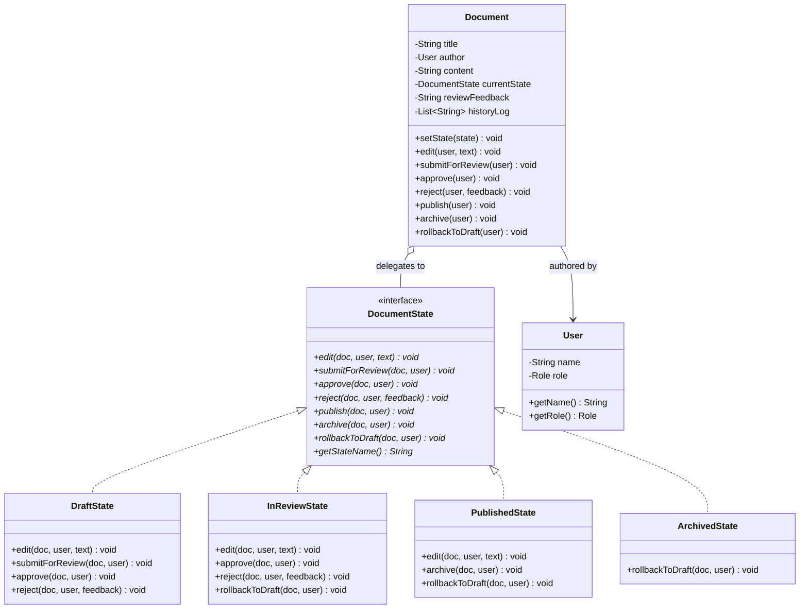
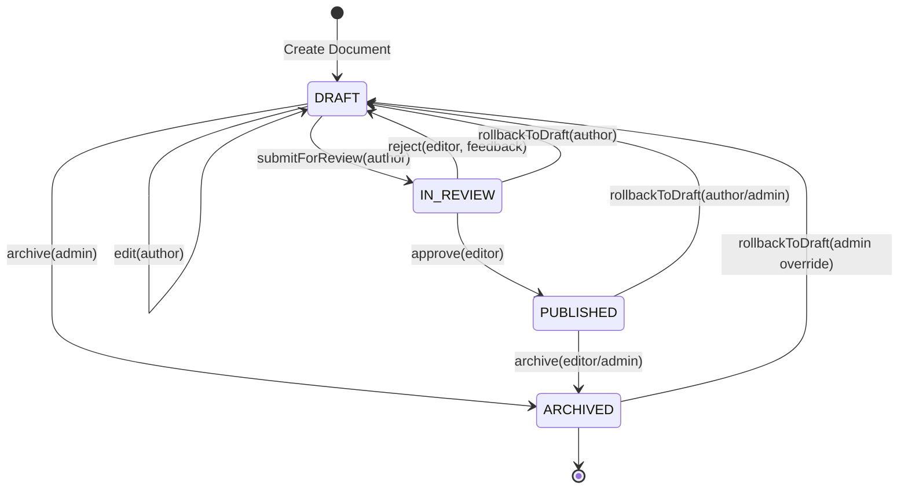

# State Design Pattern - Comprehensive Template

## 1. Overview & Intent

The **State Pattern** is a behavioral design pattern that allows an object to alter its behavior when its internal state changes. To the outside observer, the object appears to change its class dynamically.

### Formal GoF Definition
> *"Allow an object to alter its behavior when its internal state changes. The object will appear to change its class."*

---

## 2. Real-World Analogy & Motivation

### Real-World Analogy
Think of a **smartphone**:
- When the phone is **Locked**, tapping the screen does not open apps; it displays the lock screen and prompts for a passcode or fingerprint.
- When the phone is **Unlocked**, tapping the exact same screen location launches applications.
- When the battery enters **Low Power Mode**, background refresh stops, CPU clock speeds throttle, and screen brightness dims.
- The physical hardware is identical, but the internal state dictates how it responds to user actions.

### Problem It Solves
- **Massive Conditional Sprawl**: Without the State pattern, classes with complex state-dependent logic end up filled with mammoth `switch (state)` or nested `if (state == DRAFT) ... else if (state == IN_REVIEW)` blocks across every single method.
- **Fragile State Transitions**: Adding a new state or transition requires modifying every single conditional branch, introducing regression risks and violating the Open/Closed Principle.

---

## 3. Pattern Architecture & Structure



### Core Participants

| Component | Class in Template | Role & Responsibility |
|:---|:---|:---|
| **Context** | [`Document`](Document.java) | Maintains the reference to the active state, exposes client methods, and delegates behavior to `currentState`. |
| **State Interface** | [`DocumentState`](DocumentState.java) | Declares methods for every action that varies across states (`edit`, `submit`, `approve`, `reject`, `archive`). |
| **Concrete States** | [`DraftState`](DraftState.java), [`InReviewState`](InReviewState.java), [`PublishedState`](PublishedState.java), [`ArchivedState`](ArchivedState.java) | Encapsulate state-specific rules, enforce role-based permissions, and trigger state transitions on the context. |
| **Domain Model** | [`User`](User.java) | Carries actor identity and permission role (`AUTHOR`, `EDITOR`, `ADMIN`). |
| **Client** | [`Main`](Main.java) | Creates documents and invokes operations on the context. |

---

## 4. State Transition Lifecycle (FSM)



---

## 5. Transition Strategies: Who Drives the Transition?

In the State pattern, there are two primary approaches to managing transitions:

1. **State-Driven Transitions (Implemented in this Template)**:
   - Each concrete state class knows which subsequent states can follow it and calls `doc.setState(new NextState())`.
   - *Advantage*: Decentralized, highly modular; transitions are localized to the state where they make sense.
2. **Context-Driven Transitions**:
   - The State classes only return outcome status or events, and the Context determines the next state.
   - *Advantage*: Keeps states completely decoupled from their successor state classes. Best when state sequence is dynamic or table-driven.

---

## 6. Comparison: State vs. Strategy vs. Command

| Dimension | State Pattern | Strategy Pattern | Command Pattern |
|:---|:---|:---|:---|
| **Intent** | Change object behavior as internal state evolves | Interchange algorithms independently of clients | Encapsulate an operation/request as an object |
| **Awareness of Transitions** | States often know about and trigger other states | Strategies are completely isolated and oblivious to other strategies | Commands know their receiver but usually don't trigger other commands |
| **Lifetime & Switching** | Changes frequently during runtime as actions occur | Set once at configuration time, or changed occasionally by client | Executed once, stored in undo history |
| **Client Interaction** | Client calls methods on Context without knowing current state | Client explicitly chooses and injects the Strategy into Context | Client configures Invoker with Command |

---

## 7. Pros & Cons

### Pros
- **Single Responsibility Principle**: Isolates state-specific business logic into dedicated classes.
- **Open/Closed Principle**: New states and transitions can be added without modifying existing state classes.
- **Eliminates Primitive State Flags**: Removes messy boolean flags (`isDraft`, `isApproved`, `isArchived`) and nested `switch-case` statements.

### Cons
- **Class Count Overhead**: Can introduce unnecessary complexity if the state machine has only 2 or 3 static states that rarely change.

---

## 8. How to Compile & Run

```bash
# Navigate to the template directory
cd patterns/State

# Compile all source files
javac *.java

# Run the demonstration
java Main
```
