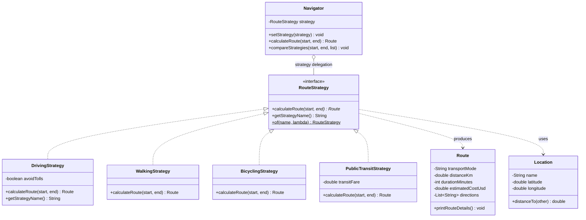
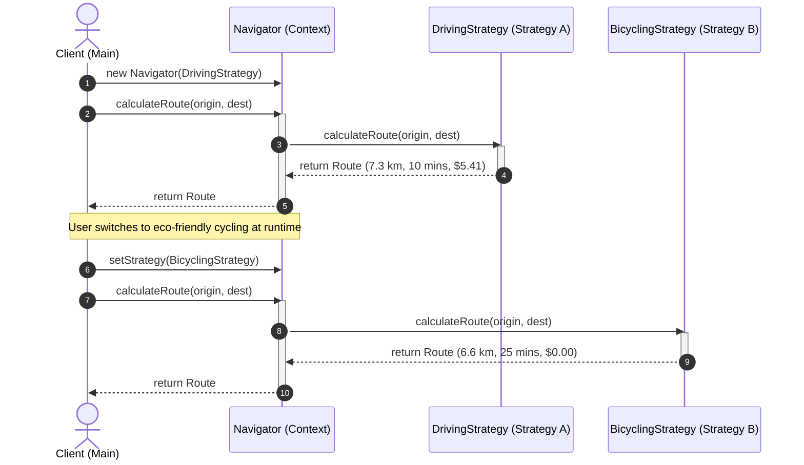

# Strategy Design Pattern - Comprehensive Template

## 1. Overview & Intent

The **Strategy Pattern** is a behavioral design pattern that defines a family of algorithms, encapsulates each one inside a separate class, and makes their objects interchangeable. It allows the algorithm to vary independently from clients that use it.

### Formal GoF Definition
> *"Define a family of algorithms, encapsulate each one, and make them interchangeable. Strategy lets the algorithm vary independently from clients that use it."*

---

## 2. Real-World Analogy & Motivation

### Real-World Analogy
Think of **traveling to the airport**:
- You can drive your own car, hail a taxi, ride a public subway train, or take a bicycle.
- Each transportation mode is an interchangeable strategy for reaching your destination.
- You choose the modality depending on your budget, time constraints, weather, and traffic.
- Your goal ("reach the airport") does not change, but the execution strategy adapts dynamically.

### Problem It Solves
- **Rigid Inheritance Hierarchies**: Using subclassing to vary algorithm behavior locks classes into compile-time rigidity and causes combinatorial class explosion.
- **Conditional Logic Spaghetti**: Giant `if (mode == DRIVING) ... else if (mode == TRANSIT)` blocks inside client classes violate the Open/Closed Principle.
- **Inability to Switch Algorithms at Runtime**: Hardcoded algorithms prevent dynamic runtime adaptation based on external environmental factors (e.g., sudden traffic jams or budget constraints).

---

## 3. Pattern Architecture & Structure



### Core Participants

| Component | Class in Template | Role & Responsibility |
|:---|:---|:---|
| **Strategy Interface** | [`RouteStrategy`](RouteStrategy.java) | Common functional interface defining `calculateRoute(Location start, Location end)`. |
| **Concrete Strategies** | [`DrivingStrategy`](DrivingStrategy.java), [`WalkingStrategy`](WalkingStrategy.java), [`BicyclingStrategy`](BicyclingStrategy.java), [`PublicTransitStrategy`](PublicTransitStrategy.java) | Encapsulate distinct routing algorithms, speed curves, toll logic, and waypoints. |
| **Context** | [`Navigator`](Navigator.java) | Maintains a reference to a `RouteStrategy` object; provides setters for runtime switching and multi-modal comparison methods. |
| **Domain Models** | [`Location`](Location.java), [`Route`](Route.java) | Value objects representing physical coordinates and calculated route metrics. |
| **Client** | [`Main`](Main.java) | Instantiates the context, injects strategies, and evaluates trade-offs. |

---

## 4. Execution & Sequence Flow



---

## 5. Modern Java Integration: Functional & Lambda Strategies

Because `RouteStrategy` is annotated with `@FunctionalInterface`, you can instantiate new ad-hoc strategies on the fly without declaring boilerplate `.java` classes:

```java
// On-the-fly Autonomous Drone Taxi Strategy using Java Lambdas
RouteStrategy droneTaxiStrategy = RouteStrategy.of("AutonomousDroneTaxi", (start, end) -> {
    double straightDist = start.distanceTo(end);
    return new Route(
        "Autonomous Drone Taxi",
        straightDist,
        4, // 4 mins direct flight
        35.00, // Premium fare
        Collections.singletonList("Direct flight corridor to rooftop vertiport")
    );
});

navigator.setStrategy(droneTaxiStrategy);
navigator.calculateRoute(origin, dest);
```

---

## 6. Comparison: Strategy vs. State vs. Template Method

| Attribute | Strategy Pattern | State Pattern | Template Method Pattern |
|:---|:---|:---|:---|
| **Mechanism** | Object Composition | Object Composition | Class Inheritance |
| **Coupling** | Strategies are completely isolated from each other | States often know about and trigger transitions to other states | Subclasses inherit invariant algorithm skeleton from abstract base class |
| **Runtime Switching** | Frequent and explicit by the client | Frequent and implicit based on object events | Impossible at runtime (compile-time inheritance) |
| **Intent** | Interchangeable algorithms / calculations | Behavior altered by internal state mutation | Reusable algorithmic invariant skeleton with hook customization |

---

## 7. Pros & Cons

### Pros
- **Open/Closed Principle**: Introduce new strategies without modifying the context class.
- **Composition over Inheritance**: Eliminates sprawling class hierarchies; favors flexible runtime delegation.
- **Eliminates Conditionals**: Removes cumbersome `switch` or `if-else` blocks selecting algorithms.
- **Clean Unit Testing**: Each strategy class can be isolated and tested independently.

### Cons
- **Client Must Be Aware of Differences**: Clients must understand how strategies differ to choose the right one.
- **Object Overhead**: Increases the total number of objects in the application (mitigated via stateless singleton strategies or lambda expressions).

---

## 8. How to Compile & Run

```bash
# Navigate to the template directory
cd patterns/Strategy

# Compile all source files
javac *.java

# Run the demonstration
java Main
```
