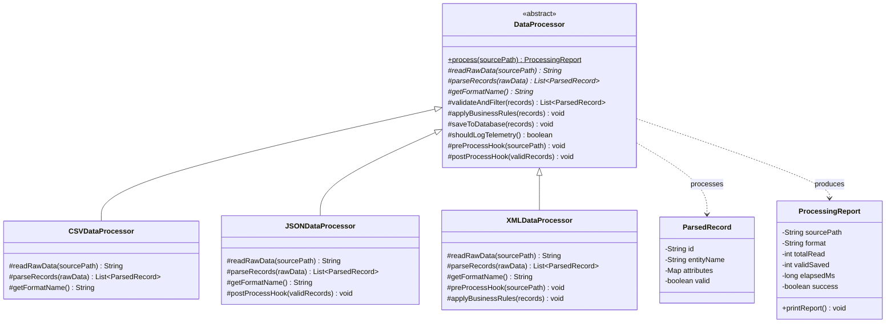
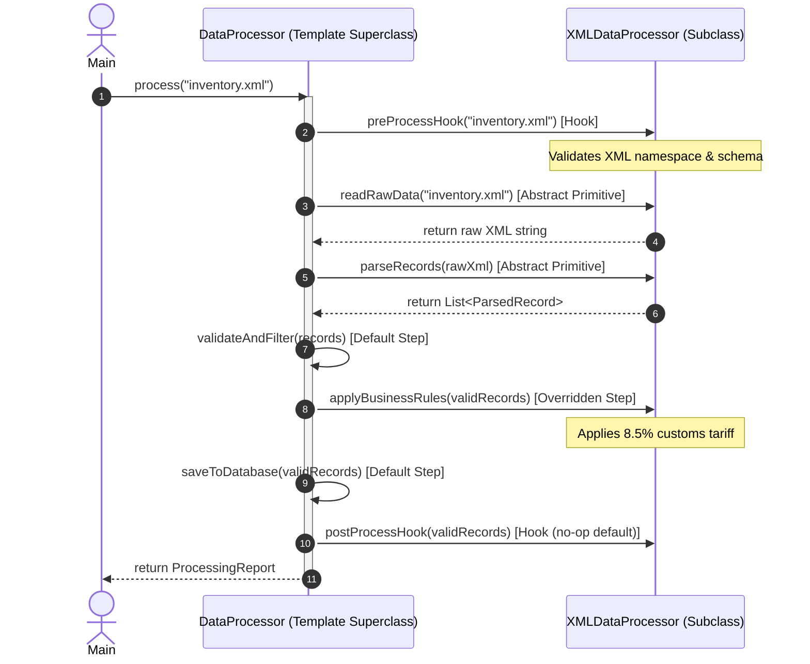

# Template Method Design Pattern - Comprehensive Template

## 1. Overview & Intent

The **Template Method Pattern** is a behavioral design pattern that defines the skeleton of an algorithm in the superclass but lets subclasses override specific steps of the algorithm without changing its overall structure.

### Formal GoF Definition
> *"Define the skeleton of an algorithm in an operation, deferring some steps to subclasses. Template Method lets subclasses redefine certain steps of an algorithm without changing the algorithm's structure."*

---

## 2. Real-World Analogy & Motivation

### Real-World Analogy
Think of building a **mass-market house**:
- An architectural firm establishes the **standard construction sequence**:
  1. Lay the foundation.
  2. Erect framing and pillars.
  3. Install plumbing and wiring.
  4. Build the walls and roof.
  5. Paint and finish interior.
- A subcontractor building a wooden cottage and a subcontractor building a concrete modern villa follow the exact same sequential steps.
- However, the materials and execution of each step (timber vs. reinforced concrete) differ completely.
- Neither subcontractor is allowed to paint walls before laying the foundation.

### Problem It Solves
- **Code Duplication Across Similar Workflows**: When multiple algorithms share identical control flow and invariant steps, duplicating the boilerplate leads to maintenance nightmares.
- **Enforcing Invariant Invariants**: If subclasses are allowed to implement the entire workflow independently, they can accidentally violate required sequences, omit security validations, or skip audit logging.

---

## 3. Pattern Architecture & Structure



### Core Participants

| Component | Class in Template | Role & Responsibility |
|:---|:---|:---|
| **Abstract Template Class** | [`DataProcessor`](DataProcessor.java) | Defines the invariant `process(sourcePath)` template method marked `final`, manages default shared steps, and declares abstract primitives and hooks. |
| **Concrete Subclasses** | [`CSVDataProcessor`](CSVDataProcessor.java), [`JSONDataProcessor`](JSONDataProcessor.java), [`XMLDataProcessor`](XMLDataProcessor.java) | Provide format-specific parsing implementations and selectively override hooks or business logic. |
| **Domain Models** | [`ParsedRecord`](ParsedRecord.java), [`ProcessingReport`](ProcessingReport.java) | Carries structured payload data and summarized pipeline execution telemetry. |
| **Client** | [`Main`](Main.java) | Invokes `process()` on various processor instances, receiving uniform reports regardless of source format. |

---

## 4. Execution & Sequence Flow (The Hollywood Principle)

The Template Method embodies the **Hollywood Principle**: *"Don't call us, we'll call you."*
The high-level abstract class calls operations in the low-level subclasses, never the reverse.



---

## 5. Anatomical Breakdown of Methods

In a well-designed Template Method, operations fall into four strict categories:

1. **The Template Method itself (`final`)**:
   ```java
   public final ProcessingReport process(String sourcePath) { ... }
   ```
   Must be `final` so subclasses cannot tamper with the algorithm's lifecycle or skip mandatory steps.
2. **Abstract Primitive Operations**:
   ```java
   protected abstract String readRawData(String sourcePath);
   protected abstract List<ParsedRecord> parseRecords(String rawData);
   ```
   Must be implemented by every concrete subclass.
3. **Concrete Default Operations**:
   ```java
   protected List<ParsedRecord> validateAndFilter(List<ParsedRecord> records) { ... }
   protected void saveToDatabase(List<ParsedRecord> records) { ... }
   ```
   Provide common implementations shared across most subclasses.
4. **Hook Methods**:
   ```java
   protected boolean shouldLogTelemetry() { return true; }
   protected void preProcessHook(String sourcePath) {}
   protected void postProcessHook(List<ParsedRecord> records) {}
   ```
   Empty or default-returning methods that subclasses can optionally override to inject custom behavior at key inflection points.

---

## 6. Comparison: Template Method vs. Strategy

| Dimension | Template Method Pattern | Strategy Pattern |
|:---|:---|:---|
| **Mechanism** | Class Inheritance (Compile-time) | Object Composition (Runtime) |
| **Scope of Variation** | Varies *individual steps* within an invariant algorithm | Replaces the *entire algorithm* |
| **Invariance** | Enforces rigid skeleton sequence via superclass `final` method | Flexible; no shared execution harness required |
| **Runtime Mutability**| Cannot change the algorithm at runtime | Can swap strategy objects on the fly |
| **Code Reuse** | High across steps via shared superclass methods | Requires separate classes or delegation helpers |

---

## 7. Pros & Cons

### Pros
- **DRY (Don't Repeat Yourself)**: Pulls common code into superclasses, leaving only unique logic in subclasses.
- **Invariable Control Flow**: Guarantees that critical steps (e.g. security validation, auditing) are never skipped.
- **Controlled Inversion of Control**: Subclasses extend behavior via designated hooks without modifying the core orchestration.

### Cons
- **Liskov Substitution Principle Risk**: Overriding default steps can inadvertently break superclass assumptions.
- **Inheritance Rigidity**: Bound to compile-time inheritance; cannot switch processing behaviors dynamically at runtime.
- **Maintenance Complexity**: As the number of hooks and primitives grows, template methods become fragile to maintain.

---

## 8. How to Compile & Run

```bash
# Navigate to the template directory
cd patterns/TemplateMethod

# Compile all source files
javac *.java

# Run the demonstration
java Main
```
