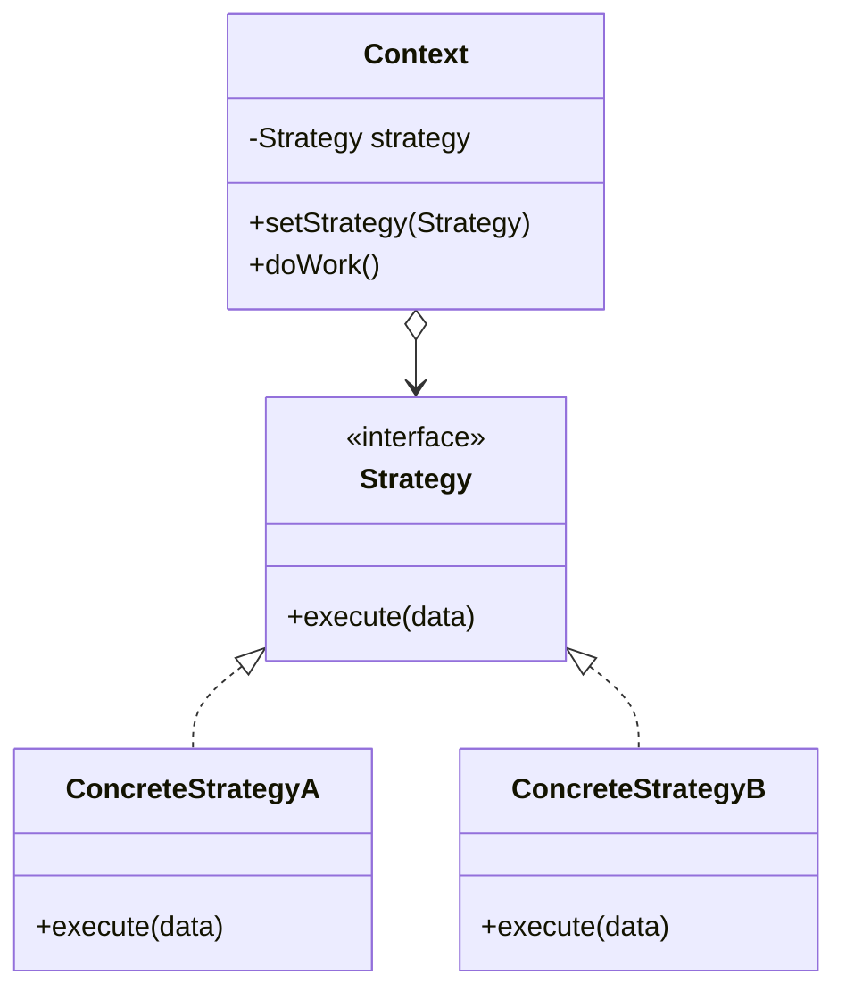
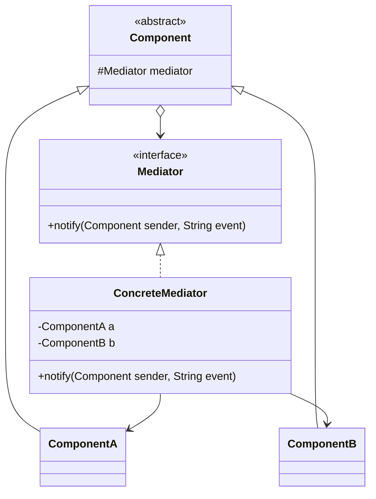
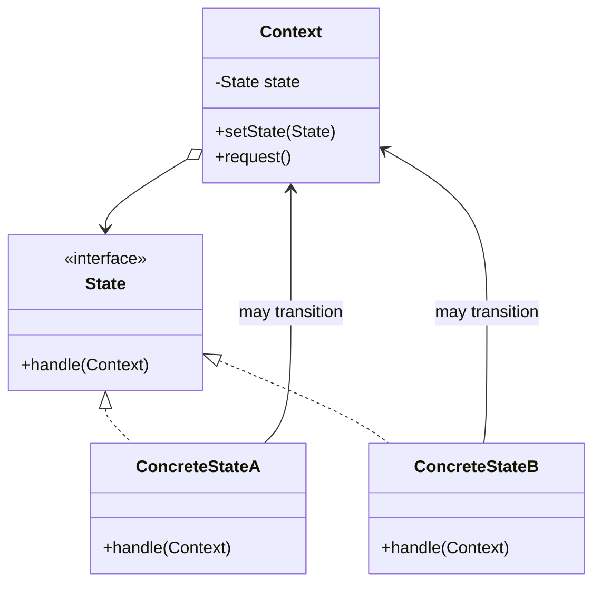

# Behavioral Design Patterns Study Guide
## Strategy, Mediator, and State

> **Source basis:** The definitions, examples, structures, and pattern comparisons follow the provided CSE 213 lecture slides. The recognition rules, keyword lists, exam workflow, and extra practice scenarios are added as study aids.
>
> **Slide examples used:** Duck simulator and map routing for **Strategy**; air-traffic control and customer-profile dialog for **Mediator**; gumball machine and document publication workflow for **State**.

---

# 0. First identify whether the problem is behavioral

The lecture defines behavioral patterns as patterns concerned with:

- how objects **behave and interact**;
- **communication** between objects;
- the **flow of responsibility**;
- how tasks are distributed and carried out;
- algorithms and the **assignment of responsibilities** between objects.

A question is likely behavioral when the main difficulty is not *creating* objects or *combining* objects structurally, but deciding:

1. **Which behavior/algorithm should execute?** → often **Strategy**.
2. **How should many objects communicate without depending directly on one another?** → often **Mediator**.
3. **How should one object behave differently as its internal condition changes?** → often **State**.

## Fastest three-way distinction

| Question hidden inside the problem | Pattern |
|---|---|
| “Which interchangeable algorithm should be used?” | **Strategy** |
| “Who coordinates communication among many objects?” | **Mediator** |
| “What is the object’s current state, and what transitions happen next?” | **State** |

## One-line memory rule

- **Strategy = choose a behavior.**
- **State = become a behavior because the current state changed.**
- **Mediator = coordinate other objects’ behavior.**

---

# 1. Strategy Pattern

## 1.1 Slide definition and intent

> **Define a family of algorithms, encapsulate each one, and make them interchangeable. Strategy lets the algorithm vary independently from the clients that use it.**

The central idea is to extract a behavior that varies, represent it through an interface, and let the context delegate that behavior to a selected implementation.

The slide’s design principles behind the Duck example are:

- **Identify the aspects of the application that vary and separate them from what stays the same.**
- **Program to an interface, not an implementation.**
- Prefer **composition** over forcing every behavioral variation into an inheritance hierarchy.

## 1.2 The problem Strategy solves

Suppose several classes need similar behavior, but the exact algorithm differs:

- different ducks fly differently;
- a map can calculate a route by car, walking, or public transport;
- a payment service can pay by card, mobile banking, or cash;
- a compression tool can use ZIP, RAR, or GZIP;
- a sorter can use quicksort, merge sort, or insertion sort.

A poor design often contains one or more of these symptoms:

- a large `if-else` or `switch` selects an algorithm;
- subclasses repeatedly override the same behavior;
- the same algorithm is duplicated in many classes;
- changing one behavior requires editing many classes;
- the required algorithm must be changed at runtime;
- the client should use an algorithm without knowing its implementation details.

### The Duck problem from the slides

Initially, putting `fly()` in the `Duck` superclass makes every duck inherit flying—even a rubber duck. Overriding `fly()` in every non-flying duck creates maintenance problems. Separate `Flyable` implementations inside every duck class also duplicate behavior. The Strategy solution extracts flying and quacking into reusable behavior objects.

## 1.3 Recognition signals in a question statement

### Strong conceptual signals

- several **alternative algorithms** solve the same task;
- the alternatives should be **interchangeable**;
- the algorithm may be selected or replaced **at runtime**;
- the context should be independent of concrete algorithms;
- the client supplies/configures a particular behavior;
- one responsibility varies while the rest of the object remains the same.

### Typical keywords and phrases

`algorithm`, `policy`, `strategy`, `method of calculation`, `multiple ways`, `choose`, `select`, `switch`, `interchangeable`, `runtime`, `different pricing rules`, `different route`, `different sorting technique`, `payment method`, `compression algorithm`, `validation rule`, `discount policy`

> Keywords are only hints. The decisive issue is whether the problem contains a **family of interchangeable algorithms**.

## 1.4 Participants and responsibilities

| Participant | Responsibility |
|---|---|
| **Strategy** | Common interface for all algorithms. |
| **ConcreteStrategy** | Implements one variation of the algorithm. |
| **Context** | Stores a Strategy reference and delegates the varying work to it. |
| **Client** | Creates/selects the concrete strategy and gives it to the Context. |

### Structure



### Memory formula

```text
Context HAS-A Strategy
Context.doWork() -> strategy.execute()
Client chooses the Strategy
```

## 1.5 How to map a question to classes

When reading an exam problem:

1. Find the **operation that remains conceptually the same**.
   - Example: “calculate route.”
2. Find the **different algorithms**.
   - Road, walking, public transport.
3. Create one interface named after the varying behavior.
   - `RouteStrategy`.
4. Create one class for each algorithm.
   - `RoadStrategy`, `WalkingStrategy`, `PublicTransportStrategy`.
5. The main object becomes the Context.
   - `Navigator`.
6. The Context stores the interface and delegates.
7. Let the client inject or replace the strategy.

## 1.6 Complete Java example: Duck simulator

```java
interface FlyBehavior {
    void fly();
}

class FlyWithWings implements FlyBehavior {
    @Override
    public void fly() {
        System.out.println("I'm flying with wings.");
    }
}

class FlyNoWay implements FlyBehavior {
    @Override
    public void fly() {
        System.out.println("I cannot fly.");
    }
}

class FlyRocketPowered implements FlyBehavior {
    @Override
    public void fly() {
        System.out.println("I'm flying with a rocket.");
    }
}

interface QuackBehavior {
    void quack();
}

class Quack implements QuackBehavior {
    @Override
    public void quack() {
        System.out.println("Quack!");
    }
}

class Squeak implements QuackBehavior {
    @Override
    public void quack() {
        System.out.println("Squeak!");
    }
}

class MuteQuack implements QuackBehavior {
    @Override
    public void quack() {
        System.out.println("<< Silence >>");
    }
}

abstract class Duck {
    protected FlyBehavior flyBehavior;
    protected QuackBehavior quackBehavior;

    public void performFly() {
        flyBehavior.fly();
    }

    public void performQuack() {
        quackBehavior.quack();
    }

    public void setFlyBehavior(FlyBehavior flyBehavior) {
        this.flyBehavior = flyBehavior;
    }

    public void setQuackBehavior(QuackBehavior quackBehavior) {
        this.quackBehavior = quackBehavior;
    }

    public void swim() {
        System.out.println("All ducks float.");
    }

    public abstract void display();
}

class MallardDuck extends Duck {
    public MallardDuck() {
        flyBehavior = new FlyWithWings();
        quackBehavior = new Quack();
    }

    @Override
    public void display() {
        System.out.println("I am a mallard duck.");
    }
}

class ModelDuck extends Duck {
    public ModelDuck() {
        flyBehavior = new FlyNoWay();
        quackBehavior = new Quack();
    }

    @Override
    public void display() {
        System.out.println("I am a model duck.");
    }
}

public class StrategyDemo {
    public static void main(String[] args) {
        Duck mallard = new MallardDuck();
        mallard.performQuack();
        mallard.performFly();

        Duck model = new ModelDuck();
        model.performFly();               // Cannot fly

        model.setFlyBehavior(new FlyRocketPowered());
        model.performFly();               // Behavior changed at runtime
    }
}
```

### Why this is Strategy

- `FlyBehavior` and `QuackBehavior` define algorithm families.
- Each implementation encapsulates one behavior.
- `Duck` does not implement the algorithms directly; it delegates.
- `setFlyBehavior()` makes the behavior dynamically replaceable.
- The flying algorithm varies independently from the `Duck` classes.

## 1.7 Exam-sized generic skeleton

```java
interface Strategy {
    void execute();
}

class StrategyA implements Strategy {
    public void execute() {
        System.out.println("Algorithm A");
    }
}

class StrategyB implements Strategy {
    public void execute() {
        System.out.println("Algorithm B");
    }
}

class Context {
    private Strategy strategy;

    Context(Strategy strategy) {
        this.strategy = strategy;
    }

    void setStrategy(Strategy strategy) {
        this.strategy = strategy;
    }

    void performTask() {
        strategy.execute();
    }
}
```

## 1.8 Benefits

- removes large algorithm-selection conditionals;
- isolates each algorithm in its own class;
- algorithms become independently testable;
- supports runtime replacement;
- new strategies can be added without changing the Context;
- shared behavior implementations can be reused by unrelated contexts.

## 1.9 Costs and traps

- introduces more classes;
- the client must know enough to choose a strategy;
- Strategy is excessive when there is only one stable algorithm;
- do not confuse “different object type” with “different algorithm.” The variation must be behavioral.

### False positive

> “A document behaves differently when it is Draft, Moderation, or Published.”

This is not primarily Strategy. The behavior depends on an internal lifecycle state and transitions occur between states, so it is **State**.

---

# 2. Mediator Pattern

## 2.1 Slide definition and intent

> **Mediator restricts direct communications between objects and forces them to collaborate only via a mediator. It reduces chaotic dependencies between objects.**

Instead of every component knowing many other components, each component knows one mediator. The mediator contains the coordination logic.

## 2.2 The problem Mediator solves

Mediator is useful when many objects interact and the communication graph becomes tangled.

Without Mediator:

```text
A knows B, C, D
B knows A, C
C knows A, B, D
D knows A, C
```

This causes:

- strong coupling between colleagues;
- poor component reuse;
- changes in one component affecting many others;
- duplicated interaction logic;
- difficult testing;
- “spaghetti” communication dependencies.

With Mediator:

```text
A -> Mediator <- B
C -> Mediator <- D
```

Each component notifies the mediator. The mediator decides which other component should react.

### Slide examples

- **Air-traffic control:** aircraft do not communicate with every other aircraft; the control tower coordinates them.
- **Customer-profile dialog:** buttons, text fields, checkboxes, and tabs should not directly contain all interaction logic. The dialog becomes the mediator.

## 2.3 Recognition signals in a question statement

### Strong conceptual signals

- many peer objects must communicate or coordinate;
- direct references create a many-to-many dependency network;
- participants should not know one another directly;
- a central coordinator should route events or requests;
- interaction rules belong to one place;
- components should be reusable in other screens/systems.

### Typical keywords and phrases

`central coordinator`, `broker`, `control tower`, `dispatcher`, `hub`, `dialog`, `controller`, `communication`, `coordinate`, `route`, `redirect`, `collaborate`, `many-to-many`, `loosely coupled`, `components must not communicate directly`, `colleagues`, `central communication object`

> A central object alone does not prove Mediator. It must centralize **interaction among peer objects**, not merely create them or store data.

## 2.4 Participants and responsibilities

| Participant | Responsibility |
|---|---|
| **Mediator** | Declares how components notify the mediator. |
| **ConcreteMediator** | Knows the participating components and contains coordination rules. |
| **Component / Colleague** | Holds a Mediator reference and notifies it instead of directly calling colleagues. |
| **ConcreteComponent** | Performs its own local behavior but delegates cross-component communication to the mediator. |

### Structure



### Memory formula

```text
Component -> notify(Mediator)
Mediator -> decides who reacts
Components do not call one another directly
```

## 2.5 How to map a question to classes

1. List all collaborating peer objects.
   - Example: checkbox, text field, apply button.
2. Identify the object that naturally knows the whole group.
   - Example: dialog/window/controller.
3. Create a Mediator interface.
4. Make every component hold only a Mediator reference.
5. Components send events such as `"click"`, `"check"`, or `"changed"`.
6. ConcreteMediator stores references to relevant components.
7. Put cross-component reaction logic inside `notify()`.

## 2.6 Complete Java example: customer-profile dialog

```java
interface Mediator {
    void notify(Component sender, String event);
}

abstract class Component {
    protected final Mediator mediator;

    protected Component(Mediator mediator) {
        this.mediator = mediator;
    }
}

class TextBox extends Component {
    private String text = "";
    private boolean enabled = true;

    TextBox(Mediator mediator) {
        super(mediator);
    }

    void setText(String text) {
        if (!enabled) {
            System.out.println("Text box is disabled.");
            return;
        }
        this.text = text;
        mediator.notify(this, "changed");
    }

    String getText() {
        return text;
    }

    void setEnabled(boolean enabled) {
        this.enabled = enabled;
        System.out.println("Company field enabled: " + enabled);
    }
}

class Checkbox extends Component {
    private boolean checked;

    Checkbox(Mediator mediator) {
        super(mediator);
    }

    void setChecked(boolean checked) {
        this.checked = checked;
        mediator.notify(this, checked ? "checked" : "unchecked");
    }

    boolean isChecked() {
        return checked;
    }
}

class Button extends Component {
    Button(Mediator mediator) {
        super(mediator);
    }

    void click() {
        mediator.notify(this, "click");
    }
}

class UserProfileDialog implements Mediator {
    private final Checkbox businessCheckbox;
    private final TextBox personName;
    private final TextBox companyName;
    private final Button applyButton;

    UserProfileDialog() {
        businessCheckbox = new Checkbox(this);
        personName = new TextBox(this);
        companyName = new TextBox(this);
        applyButton = new Button(this);

        companyName.setEnabled(false);
    }

    @Override
    public void notify(Component sender, String event) {
        if (sender == businessCheckbox) {
            companyName.setEnabled(businessCheckbox.isChecked());
        } else if (sender == applyButton && event.equals("click")) {
            validateAndSave();
        }
    }

    private void validateAndSave() {
        if (personName.getText().isBlank()) {
            System.out.println("Name is required.");
            return;
        }

        if (businessCheckbox.isChecked()
                && companyName.getText().isBlank()) {
            System.out.println("Company name is required.");
            return;
        }

        System.out.println("Profile saved successfully.");
    }

    Checkbox getBusinessCheckbox() {
        return businessCheckbox;
    }

    TextBox getPersonName() {
        return personName;
    }

    TextBox getCompanyName() {
        return companyName;
    }

    Button getApplyButton() {
        return applyButton;
    }
}

public class MediatorDemo {
    public static void main(String[] args) {
        UserProfileDialog dialog = new UserProfileDialog();

        dialog.getPersonName().setText("Nafis");
        dialog.getBusinessCheckbox().setChecked(true);
        dialog.getCompanyName().setText("Example Ltd.");
        dialog.getApplyButton().click();
    }
}
```

### Why this is Mediator

- the checkbox does not directly enable the company text box;
- the apply button does not directly inspect all fields;
- components only notify `UserProfileDialog`;
- the dialog knows the components and coordinates their reactions;
- component classes remain reusable in another dialog with another mediator.

## 2.7 Exam-sized generic skeleton

```java
interface Mediator {
    void notify(Component sender, String event);
}

abstract class Component {
    protected Mediator mediator;

    Component(Mediator mediator) {
        this.mediator = mediator;
    }
}

class ComponentA extends Component {
    ComponentA(Mediator mediator) {
        super(mediator);
    }

    void action() {
        mediator.notify(this, "A_EVENT");
    }
}

class ComponentB extends Component {
    ComponentB(Mediator mediator) {
        super(mediator);
    }

    void react() {
        System.out.println("B reacts");
    }
}

class ConcreteMediator implements Mediator {
    private ComponentA a;
    private ComponentB b;

    void register(ComponentA a, ComponentB b) {
        this.a = a;
        this.b = b;
    }

    public void notify(Component sender, String event) {
        if (sender == a && event.equals("A_EVENT")) {
            b.react();
        }
    }
}
```

## 2.8 Benefits

- removes chaotic many-to-many dependencies;
- centralizes interaction rules;
- components become easier to reuse;
- component classes have fewer reasons to change;
- communication becomes easier to trace and test;
- complex workflows can be changed in one place.

## 2.9 Costs and traps

- the mediator can become a very large **God Object**;
- too much business logic may accumulate inside one mediator;
- the mediator itself may become difficult to maintain;
- simple direct communication may be clearer when only two objects interact.

### False positive: Strategy

> “A navigator chooses walking, road, or public transport routing.”

This is **Strategy**, because the alternatives are algorithms. It is not mainly about coordinating many peer objects.

### False positive: Factory

> “A central class creates all toolbar buttons.”

That may be a factory. It becomes Mediator only when it coordinates how those buttons and other components communicate after creation.

---

# 3. State Pattern

## 3.1 Slide definition and intent

> **Allow an object to alter its behavior when its internal state changes. The object will appear to change its class.**

The object does not literally change its Java class. It delegates state-dependent behavior to another State object, and the current State reference changes.

## 3.2 The problem State solves

State is useful when one object has several meaningful conditions and the same operation behaves differently in each condition.

Typical poor design:

```java
if (state == NO_QUARTER) {
    // behavior
} else if (state == HAS_QUARTER) {
    // behavior
} else if (state == SOLD) {
    // behavior
} else if (state == SOLD_OUT) {
    // behavior
}
```

The same state-checking chain is then repeated in `insertQuarter()`, `ejectQuarter()`, `turnCrank()`, `dispense()`, and other methods. Adding one state requires modifying every conditional method.

State replaces those repeated conditionals with one object per state.

### Slide examples

- **Gumball machine:** `NoQuarter`, `HasQuarter`, `Sold`, `SoldOut`, and later `Winner`.
- **Document publication:** `Draft`, `Moderation`, and `Published`; `publish()` behaves differently in each state.

## 3.3 Recognition signals in a question statement

### Strong conceptual signals

- behavior depends on an object’s **current internal state**;
- the object moves through a lifecycle or workflow;
- events cause **state transitions**;
- an operation is valid in some states and invalid in others;
- many methods contain repeated conditionals checking the same state variable;
- new states are expected;
- each state should encapsulate its own rules and next transition.

### Typical keywords and phrases

`state`, `status`, `mode`, `current state`, `transition`, `lifecycle`, `workflow`, `phase`, `draft`, `approved`, `published`, `locked`, `unlocked`, `idle`, `running`, `paused`, `connected`, `disconnected`, `pending`, `completed`, `valid only when`, `depending on current status`, `moves to`, `changes into`

> “Mode” is ambiguous. A user-selected independent mode may be Strategy. A mode that is part of an internal lifecycle with transitions is State.

## 3.4 Participants and responsibilities

| Participant | Responsibility |
|---|---|
| **State** | Declares the state-specific operations. |
| **ConcreteState** | Implements behavior for one state and may trigger a transition. |
| **Context** | Stores the current State and delegates state-dependent requests. |
| **Client** | Usually interacts with the Context, not directly with State objects. |

### Structure



### Memory formula

```text
Context HAS-A current State
Context.request() -> state.handle()
State behavior may change Context.state
```

## 3.5 How to map a question to classes

1. List all states explicitly.
   - Example: `NoQuarter`, `HasQuarter`, `Sold`, `SoldOut`.
2. List operations whose behavior changes by state.
   - `insertQuarter`, `ejectQuarter`, `turnCrank`, `dispense`.
3. Put those operations in one State interface.
4. Create one ConcreteState class per state.
5. Give each state access to the Context when it must cause transitions.
6. Context stores all required state objects and one `currentState` reference.
7. Context’s public methods simply delegate.
8. Transitions happen by replacing the current state.

## 3.6 Complete Java example: Gumball machine

```java
import java.util.Random;

interface State {
    void insertQuarter();
    void ejectQuarter();
    void turnCrank();
    void dispense();
}

class GumballMachine {
    private final State soldOutState;
    private final State noQuarterState;
    private final State hasQuarterState;
    private final State soldState;
    private final State winnerState;

    private State state;
    private int count;

    GumballMachine(int count) {
        soldOutState = new SoldOutState(this);
        noQuarterState = new NoQuarterState(this);
        hasQuarterState = new HasQuarterState(this);
        soldState = new SoldState(this);
        winnerState = new WinnerState(this);

        this.count = count;
        state = count > 0 ? noQuarterState : soldOutState;
    }

    void insertQuarter() {
        state.insertQuarter();
    }

    void ejectQuarter() {
        state.ejectQuarter();
    }

    void turnCrank() {
        state.turnCrank();
        state.dispense();
    }

    void setState(State state) {
        this.state = state;
    }

    void releaseBall() {
        if (count > 0) {
            System.out.println("A gumball rolls out.");
            count--;
        }
    }

    int getCount() {
        return count;
    }

    State getSoldOutState() {
        return soldOutState;
    }

    State getNoQuarterState() {
        return noQuarterState;
    }

    State getHasQuarterState() {
        return hasQuarterState;
    }

    State getSoldState() {
        return soldState;
    }

    State getWinnerState() {
        return winnerState;
    }
}

class NoQuarterState implements State {
    private final GumballMachine machine;

    NoQuarterState(GumballMachine machine) {
        this.machine = machine;
    }

    public void insertQuarter() {
        System.out.println("Quarter inserted.");
        machine.setState(machine.getHasQuarterState());
    }

    public void ejectQuarter() {
        System.out.println("No quarter to eject.");
    }

    public void turnCrank() {
        System.out.println("Insert a quarter first.");
    }

    public void dispense() {
        System.out.println("Payment required.");
    }
}

class HasQuarterState implements State {
    private final GumballMachine machine;
    private final Random random = new Random();

    HasQuarterState(GumballMachine machine) {
        this.machine = machine;
    }

    public void insertQuarter() {
        System.out.println("A quarter is already inserted.");
    }

    public void ejectQuarter() {
        System.out.println("Quarter returned.");
        machine.setState(machine.getNoQuarterState());
    }

    public void turnCrank() {
        System.out.println("Crank turned.");

        boolean winner = random.nextInt(10) == 0
                && machine.getCount() > 1;

        if (winner) {
            machine.setState(machine.getWinnerState());
        } else {
            machine.setState(machine.getSoldState());
        }
    }

    public void dispense() {
        System.out.println("Turn the crank first.");
    }
}

class SoldState implements State {
    private final GumballMachine machine;

    SoldState(GumballMachine machine) {
        this.machine = machine;
    }

    public void insertQuarter() {
        System.out.println("Please wait; dispensing.");
    }

    public void ejectQuarter() {
        System.out.println("Too late; crank already turned.");
    }

    public void turnCrank() {
        System.out.println("Turning twice gives no extra gumball.");
    }

    public void dispense() {
        machine.releaseBall();

        if (machine.getCount() > 0) {
            machine.setState(machine.getNoQuarterState());
        } else {
            System.out.println("Machine is now sold out.");
            machine.setState(machine.getSoldOutState());
        }
    }
}

class WinnerState implements State {
    private final GumballMachine machine;

    WinnerState(GumballMachine machine) {
        this.machine = machine;
    }

    public void insertQuarter() {
        System.out.println("Please wait; dispensing prize.");
    }

    public void ejectQuarter() {
        System.out.println("Too late; crank already turned.");
    }

    public void turnCrank() {
        System.out.println("Turning twice gives no extra prize.");
    }

    public void dispense() {
        System.out.println("Winner: two gumballs for one quarter.");
        machine.releaseBall();

        if (machine.getCount() == 0) {
            machine.setState(machine.getSoldOutState());
            return;
        }

        machine.releaseBall();

        if (machine.getCount() > 0) {
            machine.setState(machine.getNoQuarterState());
        } else {
            machine.setState(machine.getSoldOutState());
        }
    }
}

class SoldOutState implements State {
    private final GumballMachine machine;

    SoldOutState(GumballMachine machine) {
        this.machine = machine;
    }

    public void insertQuarter() {
        System.out.println("Machine is sold out.");
    }

    public void ejectQuarter() {
        System.out.println("No quarter was inserted.");
    }

    public void turnCrank() {
        System.out.println("No gumballs available.");
    }

    public void dispense() {
        System.out.println("Nothing dispensed.");
    }
}

public class StateDemo {
    public static void main(String[] args) {
        GumballMachine machine = new GumballMachine(5);

        machine.insertQuarter();
        machine.turnCrank();

        machine.insertQuarter();
        machine.ejectQuarter();
    }
}
```

### Why this is State

- `GumballMachine` delegates every state-dependent action to `state`.
- each concrete state localizes behavior for one machine condition;
- states know the machine and can select the next state;
- invalid operations are handled inside the relevant state;
- adding `WinnerState` does not require rewriting every action method in `GumballMachine`.

## 3.7 Exam-sized generic skeleton

```java
interface State {
    void handle(Context context);
}

class StateA implements State {
    public void handle(Context context) {
        System.out.println("Behavior in A");
        context.setState(new StateB());
    }
}

class StateB implements State {
    public void handle(Context context) {
        System.out.println("Behavior in B");
    }
}

class Context {
    private State state = new StateA();

    void setState(State state) {
        this.state = state;
    }

    void request() {
        state.handle(this);
    }
}
```

## 3.8 Benefits

- localizes behavior of each state in one class;
- removes repeated state conditionals;
- makes transitions explicit;
- supports adding new states with fewer changes to Context;
- allows state-specific invalid-operation handling;
- separates lifecycle rules from the main object.

## 3.9 Costs and traps

- creates many small classes;
- transition logic can become scattered across state classes;
- simple two-state objects may not justify the pattern;
- shared behavior may need an abstract state class to avoid duplication;
- careless transitions can create cycles or unreachable states.

### False positive: Strategy

> “The user chooses one of three tax-calculation policies.”

This is usually **Strategy** because the client chooses an independent algorithm. It becomes State only if the object’s internal lifecycle determines the calculation and transitions automatically.

---

# 4. State vs Strategy — the most important distinction

The slides describe them as **“twins separated at birth.”** Both:

- use composition;
- change Context behavior by delegating work to helper objects;
- usually contain an interface and multiple implementations.

The difference is the **meaning and control of the replacement**.

| Issue | Strategy | State |
|---|---|---|
| Main purpose | Select among algorithms/policies. | Represent internal conditions/lifecycle. |
| Who usually chooses? | Client or configuration chooses. | Current state/context logic chooses next state. |
| Do implementations know one another? | Normally independent and unaware. | Concrete states may know/select other states. |
| Does a transition graph exist? | Usually no. | Usually yes. |
| Is order meaningful? | No required sequence. | States often follow valid transitions. |
| Same request | Same task using another algorithm. | Same operation means different things in different states. |
| Example | Driving vs walking route. | Draft → Moderation → Published. |

## Diagnostic questions

Ask in this order:

1. **Can the client freely choose any behavior without a lifecycle?**
   - Yes → Strategy.
2. **Is there a current status and a valid next status?**
   - Yes → State.
3. **Do concrete implementations trigger transitions themselves?**
   - Strong State signal.
4. **Are implementations merely alternative formulas/algorithms?**
   - Strong Strategy signal.

## Ambiguous “mode” example

### Music player: playback mode selected by the user

- Shuffle, repeat-one, repeat-all as alternative playback algorithms → **Strategy**.

### Music player: internal operating condition

- Stopped, Playing, Paused; pressing the same button acts differently and causes transitions → **State**.

---

# 5. Mediator vs the other two

## Mediator vs Strategy

- Strategy changes **how one task is performed**.
- Mediator changes **how multiple objects communicate**.

A central route-selection object is not automatically Mediator. If it merely delegates to a routing algorithm, it is Strategy. If it coordinates requests among several independent route servers, traffic services, and UI components, a Mediator may also be present.

## Mediator vs State

- State organizes behavior by the current condition of one Context.
- Mediator organizes communication among many peer components.

A workflow controller may contain both:

- **State** for the workflow’s current phase;
- **Mediator** for communication among UI controls, services, or participants.

## Mediator vs Observer — slide distinction

- **Mediator:** eliminates mutual dependencies; objects depend on one mediator.
- **Observer:** establishes a dynamic one-way one-to-many subscription relationship.

Use Observer when one subject broadcasts changes to subscribers. Use Mediator when several colleagues need coordinated two-way/multi-way collaboration without direct dependencies.

## Mediator vs Command — useful exam distinction

- **Command:** wraps a request as an object; useful for queueing, logging, undo, and replay.
- **Mediator:** routes or coordinates communication between senders and receivers.

A broker may use both: Mediator for coordination and Command objects for queued requests.

---

# 6. Pattern-selection decision procedure

Use this procedure while reading a question.

## Step 1: Underline the changing part

- changing **algorithm/policy** → Strategy candidate;
- changing **internal status/lifecycle** → State candidate;
- changing **interaction among components** → Mediator candidate.

## Step 2: Identify the dominant relationship

```text
One context -> one selected algorithm      = Strategy
One context -> one current lifecycle state = State
Many colleagues -> one coordinator         = Mediator
```

## Step 3: Look for control

- client/configuration selects implementation → Strategy;
- current state/event determines next implementation → State;
- mediator decides which colleague reacts → Mediator.

## Step 4: Look for the bad code the pattern would remove

| Bad code/dependency | Pattern |
|---|---|
| `switch(algorithmType)` | Strategy |
| repeated `if (state == ...)` in many methods | State |
| A directly calls B, C, D; B directly calls C, D | Mediator |

## Step 5: State the reason in one sentence

- **Strategy:** “The problem contains interchangeable algorithms that should vary independently from the Context.”
- **State:** “The object’s behavior depends on its current internal state, and events cause state transitions.”
- **Mediator:** “Several peer objects have tangled dependencies, so communication should be centralized through a mediator.”

---

# 7. Keyword cheat sheet

| Strategy signals | State signals | Mediator signals |
|---|---|---|
| algorithm | state/status | coordinator |
| policy | transition | mediator |
| choose/select | lifecycle | broker |
| interchangeable | phase | control tower |
| runtime replacement | current mode | central hub |
| pricing formula | valid/invalid action | route communication |
| payment method | pending/approved | components collaborate |
| sorting method | draft/published | no direct communication |
| route type | locked/unlocked | reduce coupling |
| compression technique | idle/running/paused | many-to-many dependencies |

## High-confidence phrases

- “Choose among several algorithms at runtime” → **Strategy**.
- “Behavior depends on current state” → **State**.
- “Objects must not communicate directly” → **Mediator**.

---

# 8. Class-order memory aids for handwritten code

## Strategy order

```text
1. Strategy interface
2. ConcreteStrategy classes
3. Context with Strategy field
4. setter/constructor injection
5. Context delegates
6. Client selects strategy
```

## Mediator order

```text
1. Mediator interface
2. Component base class with Mediator field
3. Concrete components notify mediator
4. ConcreteMediator stores component references
5. ConcreteMediator reacts in notify(...)
6. Client creates/connects components
```

## State order

```text
1. State interface containing state-dependent operations
2. Context with current State
3. ConcreteState classes
4. States receive Context reference if transitions are needed
5. Context delegates all actions to current State
6. State changes Context's current State
```

---

# 9. Mini identification practice

## Scenario 1

A map application calculates a route using road, walking, cycling, or public transport. The user may change the route method while the application is running.

**Answer: Strategy.** These are interchangeable route-building algorithms.

## Scenario 2

A document can be Draft, Moderation, or Published. Calling `publish()` submits a Draft for moderation, publishes an approved document, and does nothing when already Published.

**Answer: State.** The same operation behaves according to the current lifecycle state.

## Scenario 3

Aircraft cannot communicate directly. Every aircraft sends requests to a control tower, and the tower tells relevant aircraft what to do.

**Answer: Mediator.** The control tower centralizes collaboration among peers.

## Scenario 4

An e-commerce service supports credit-card, mobile-wallet, and cash-on-delivery payment calculation. New payment methods should be added without changing checkout.

**Answer: Strategy.** Payment algorithms should be encapsulated and interchangeable.

## Scenario 5

A network connection is Disconnected, Connecting, Connected, or Failed. `send()` and `disconnect()` behave differently in each condition, and operations cause transitions.

**Answer: State.** There is a transition-driven lifecycle.

## Scenario 6

A smart-home hub receives events from sensors and coordinates lights, alarms, doors, and notifications. Devices should not hold references to every other device.

**Answer: Mediator.** The hub coordinates communication and removes direct dependencies.

## Scenario 7

A game character may use aggressive, defensive, or stealth attack logic, and the player selects one at any time.

**Answer: Strategy.** The attack algorithm is deliberately selected.

## Scenario 8

A vending machine has Idle, PaymentReceived, Dispensing, and OutOfStock conditions. Adding a maintenance state currently requires editing every operation.

**Answer: State.** Repeated conditionals represent state-dependent behavior.

---

# 10. Final exam checklist

Before naming the pattern, write these three questions in the margin:

```text
Algorithms?       -> Strategy
Internal states?  -> State
Communication?    -> Mediator
```

Then justify using the exact dominant problem:

- **Strategy:** family of interchangeable algorithms.
- **State:** behavior changes with internal state and transitions.
- **Mediator:** direct communication is restricted; colleagues collaborate through one mediator.

Do not decide from a single keyword. Identify:

1. what varies;
2. who controls the variation;
3. whether transitions exist;
4. whether the main problem is algorithm choice or object communication;
5. which class should hold the interface reference.

---

# 11. Ultra-short revision card

```text
STRATEGY
Context has Strategy.
Client chooses it.
Different algorithm, same task.

STATE
Context has current State.
State/event changes it.
Same request, different response by lifecycle status.

MEDIATOR
Components have Mediator.
They notify it, not each other.
Mediator coordinates reactions.
```
